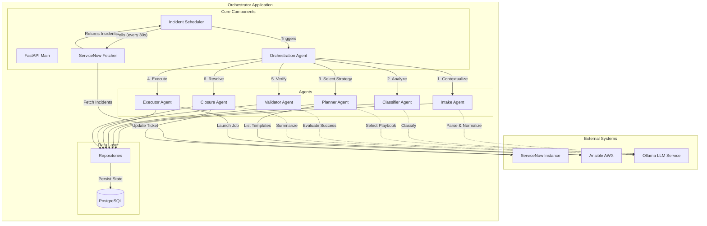

# System Architecture

## Overview
The solution is an **Intelligent Incident Remediation Orchestrator** driven by LLMs. It automates the lifecycle of infrastructure incidents by fetching them from ServiceNow, planning remediation, executing Ansible playbooks via AWX, and validating the results.

## Architecture Diagram

## Component Description

### Core Components
- **Incident Scheduler**: Periodically polls ServiceNow for new active incidents.
- **ServiceNow Fetcher**: Adapter to communicate with ServiceNow API.
- **Orchestration Agent**: The central controller that manages the sequential execution of the agentic pipeline.

### Agents
1.  **Intake Agent**: structuring the raw incident data into a clean, canonical format.
2.  **Classifier Agent**: Analyzes the incident to determine severity, category, and eligibility for auto-remediation.
3.  **Planner Agent**: matches the incident to the most appropriate Ansible playbook template available in AWX.
4.  **Executor Agent**: Triggers the selected playbook in AWX and monitors its execution status.
5.  **Validator Agent**: Analyzes execution logs and telemetry to determine if the remediation was successful.
6.  **Closure Agent**: Updates the ServiceNow ticket with execution notes, resolution summary, and closes it if successful.

### Infrastructure
- **PostgreSQL**: Stores the state of every orchestration (Incidents, Plans, Executions, Validations).
- **Ollama**: Provides local LLM inference for agent decision-making.
- **Ansible AWX**: The execution engine for infrastructure changes.
